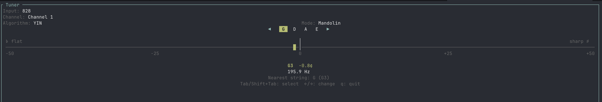

# tuner

A terminal-based instrument tuner built with Rust and [ratatui](https://github.com/ratatui/ratatui).



## Features

- Real-time pitch detection from your microphone
- Three detection algorithms: YIN, MPM, and FFT
- Instrument modes for **guitar** and **mandolin** (standard tuning) with per-string targeting
- Free mode for chromatic tuning of any instrument
- Visual tuning meter with color-coded accuracy (green/yellow/red)
- Configurable reference pitch (default A4 = 440 Hz)
- Input device and channel selection

## Install

### From GitHub releases

Pre-built binaries for macOS and Linux (x86_64 and ARM64) are available on the [releases page](https://github.com/bgroff/tuner-tui/releases).

### From source

```sh
cargo install --git https://github.com/bgroff/tuner-tui
```

### Build from source

```sh
git clone https://github.com/bgroff/tuner-tui.git
cd tuner-tui
cargo build --release
```

> **Linux note:** You'll need ALSA development headers installed (`libasound2-dev` on Debian/Ubuntu).

## Usage

```sh
tuner
```

### Options

```
--reference <HZ>    Reference pitch for A4 in Hz (default: 440)
```

### Controls

| Key              | Action                        |
|------------------|-------------------------------|
| `Tab`/`Shift+Tab`| Cycle through selectors       |
| `Left`/`Right`  | Change the selected setting   |
| `q`              | Quit                          |

## License

MIT
